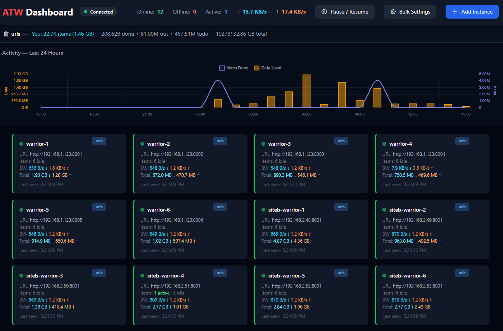

# ATW Dashboard

A real-time monitoring and control dashboard for [ArchiveTeam Warrior](https://wiki.archiveteam.org/index.php/ArchiveTeam_Warrior) Docker instances.



## Features

- **Live Monitoring** — WebSocket-driven real-time updates for all warrior instances
- **Bulk Settings** — Change nickname, concurrent items, and rsync threads across all warriors at once
- **Bulk Project Switching** — Switch all warriors to a different project in one click
- **Pause / Resume** — Pause warriors with optional timed auto-resume (1h, 3h, 6h, 12h, 24h, or indefinite)
- **24h Activity Chart** — Combined data usage (bar) and tracker items (line) chart with dual y-axes
- **Tracker Integration** — Live leaderboard stats pulled from ArchiveTeam tracker (items done, out, todo, your contribution)
- **Instance Management** — Add, edit, and remove warrior instances on the fly
- **Persistent State** — Config, history, and pause state survive restarts via JSON files in `/app/data`
- **Dark Theme** — Clean dark UI built with Tailwind CSS

## Tech Stack

| Component | Technology |
|-----------|-----------|
| Backend | Python 3.11+, FastAPI, httpx, BeautifulSoup4 |
| Frontend | Vanilla JS, Tailwind CSS (CDN), Chart.js 4 |
| Warrior Comms | SockJS xhr-polling (same protocol the warrior UI uses) |
| Data | JSON file storage (no database required) |

## Quick Start

### Docker Compose (recommended)

```yaml
version: "3"
services:
  atw-dashboard:
    build: .
    ports:
      - "8080:8080"
    volumes:
      - ./data:/app/data
    environment:
      - LOG_LEVEL=info
    restart: unless-stopped
```

```bash
docker compose up -d
```

Then open `http://localhost:8080` and click **Add Instance** to connect your first warrior.

### Manual

```bash
pip install -r requirements.txt
uvicorn backend.main:app --host 0.0.0.0 --port 8080
```

## Configuration

### config.yml

Place in the project root or `data/` directory:

```yaml
title: "ATW Dashboard"
poll_interval: 5
reconnect_base: 5
reconnect_max: 60
```

### Environment Variables

| Variable | Default | Description |
|----------|---------|-------------|
| `LOG_LEVEL` | `info` | Logging level (debug, info, warning, error) |
| `DATA_DIR` | `./data` | Directory for persistent state files |

## Data Files

All persistent state is stored in `DATA_DIR`:

| File | Purpose |
|------|---------|
| `instances.json` | Saved warrior instance configs |
| `history.json` | 24h activity data for the chart |
| `pause.json` | Pause state with auto-resume timers |

## Architecture

```
Browser ←→ WebSocket ←→ FastAPI ←→ SockJS xhr-polling ←→ Warrior(s)
                          ↕
                     JSON files (data/)
```

The backend opens a SockJS session to each warrior (the same protocol the warrior's own web UI uses), receives real-time events (`project.refresh`, `bandwidth`, `project.item.task`, etc.), and aggregates them into a dashboard state that's broadcast to all connected browsers via WebSocket every 2 seconds.

---

> **⚠️ Disclaimer**
>
> This project is **vibecoded** and intended for **personal use only**. It was built iteratively with AI assistance and has not been formally tested or audited.
>
> **No support will be provided. Pull requests will not be reviewed or merged.**
>
> If it works for you, great. If it doesn't, you get to keep both pieces.

## License

This project is licensed under the [Creative Commons Attribution-NonCommercial 4.0 International License](LICENSE) (CC BY-NC 4.0).

You are free to share and adapt this work for non-commercial purposes with attribution. See [LICENSE](LICENSE) for full terms.
